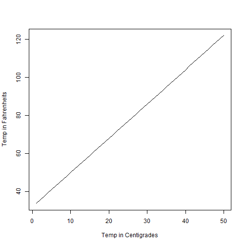

TempConverterPitch
========================================================
author: ~ M.A.N.D.A.R ~
date: 22-MAR-2021
autosize: true

About
========================================================

This is a small application that converts a user input temperature 
from Centigrades or Celcius into Fahrenheits OR vice-a-versa.

User can also select a date from the date picker control, and prints the same.
Although the date has no link to the temperature, it as added only as fun element.

Relationship between Centigrade & Fahrenheits
========================================================

User Instructions (for Shiny Application)
========================================================

- Application Link --> https://mmuthye.shinyapps.io/TempConverter/
- The date picker shows today's date. Play around with this cool date picker if you wish to change the date/month/year. (It has nothing to do with temperature).
- Select the appropriate option for conversion of temperature
- Select the temperature value by moving the slider
- Click the Submit button to find the converted temperature value, and the date selected in the date picker
- Play around with more options :)

That's It!
========================================================

Hope you had fun with this simple application.

THANK YOU!
